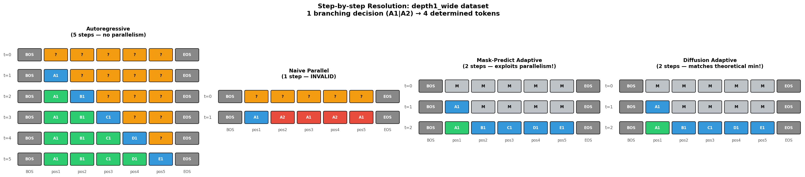
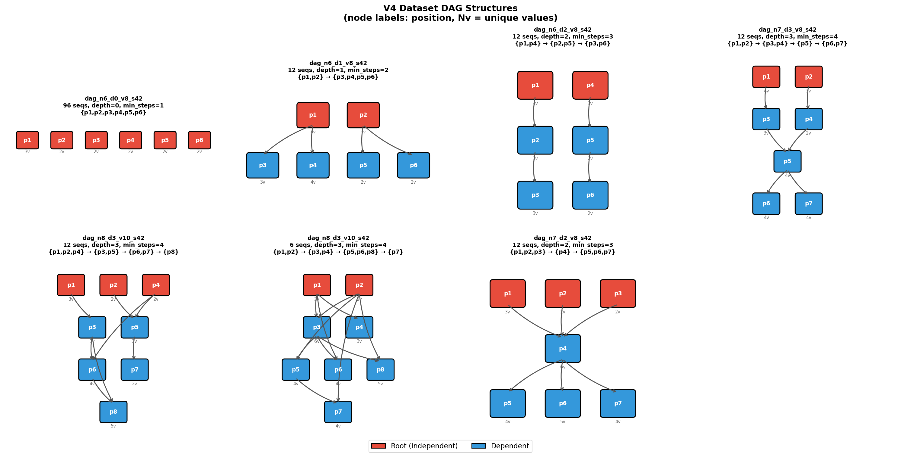
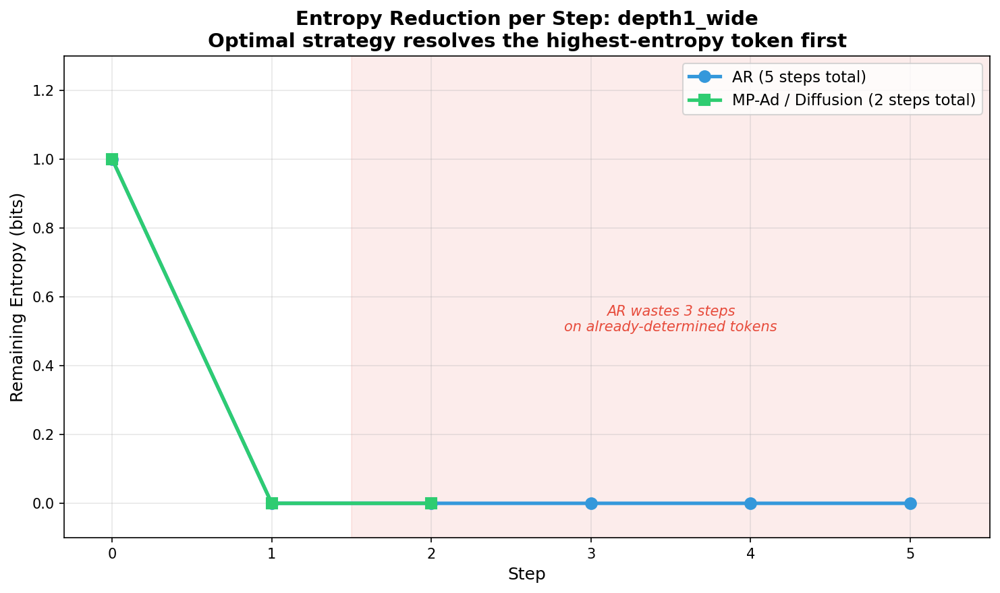

# Why Can't We Generate All Tokens at Once?

*The fundamental speed limit of parallel text generation, explained with toy experiments.*

---

## The Promise and the Problem

Autoregressive language models generate one token at a time. For a sequence of N tokens, that's N sequential forward passes. What if we could generate all N tokens in parallel — one forward pass, done?

It turns out we can't. Not because of engineering limitations, but because of a fundamental property of the data itself. This post explains why, defines exactly when parallelism helps, and shows which methods get closest to the theoretical speed limit.

All code and experiments are available in [this repository](https://github.com/lee-wanhee/parallel-generation).

---

## Part 1: The Simplest Example

Consider a language with exactly two valid sentences:

```
[BOS] I  am  [EOS]     (50% probability)
[BOS] We are [EOS]     (50% probability)
```

An autoregressive model learns: *"after BOS, output 'I' or 'We' with equal probability. If you said 'I', output 'am'. If you said 'We', output 'are'."*

**Autoregressive generation** (2 forward passes):
1. Feed `[BOS]` → sample `I` or `We` (50/50)
2. Feed `[BOS, I]` → output `am` (100% certain)

Result: always produces a valid sentence. 50/50 diversity. 2 forward passes.

**Naive parallel generation** (1 forward pass):
1. Feed `[BOS]` → predict position 1 AND position 2 simultaneously
2. Position 1 outputs `I` or `We` (50/50) — correct so far
3. Position 2 doesn't know what position 1 chose → outputs a mix of `am` and `are`
4. Sample both independently

Result: produces `I are` and `We am` most of the time. **Less than 1% valid**.

```
Autoregressive:               Parallel:
  I am    — 49.1%               I I     — 19.2%
  We are  — 50.9%               We I    — 18.5%
                                I We    — 16.4%
                                We We   — 15.6%
                                ...
                                I am    —  0.4%   ← valid!
                                We are  —  0.2%   ← valid!
```

This is not a model quality issue. The model learned the data perfectly. The problem is that **position 2's correct answer depends on position 1's actual value**, and parallel generation doesn't provide that information.

<p align="center">
  
</p>

---

## Part 2: Dependencies as a DAG

The "I am / We are" example has a simple dependency: position 2 depends on position 1. But real sequences have richer structures. We can represent token dependencies as a **directed acyclic graph (DAG)**.

### Example structures

**Independent** — all tokens can be generated in parallel:
```
  p1   p2   p3   p4         No edges.
                             Schedule: {p1, p2, p3, p4}  →  1 step
```

**Chain** — purely sequential:
```
  p1 → p2 → p3 → p4         Each token depends on the previous.
                             Schedule: {p1} → {p2} → {p3} → {p4}  →  4 steps
```

**Wide tree** — one decision unlocks many:
```
      p1                    One root, four leaves.
    / | \ \                 Schedule: {p1} → {p2, p3, p4, p5}  →  2 steps
  p2 p3 p4 p5
```

**Diamond** — convergence:
```
      p1                    p4 depends on BOTH p2 and p3.
     / \                    Schedule: {p1} → {p2, p3} → {p4}  →  3 steps
   p2   p3
     \ /
      p4
```

**Hourglass** — wide, narrow, wide:
```
  p1  p2  p3                Three roots converge to bottleneck p4,
    \ | /                   then fan out again.
     p4                     Schedule: {p1,p2,p3} → {p4} → {p5,p6,p7}  →  3 steps
    / | \
  p5 p6 p7
```

<p align="center">
  
</p>

---

## Part 3: The Theoretical Speed Limit

### Definition: Sequential Depth

The **sequential depth** of a DAG is the length of its longest path. This is the number of positions that form a chain of dependencies — no parallelism can help with these.

### Theorem: Minimum Steps

> **For any generation method that produces valid and diverse samples from a distribution with dependency DAG of depth D, the minimum number of forward passes is D + 1.**

**Why D + 1?** You need at least 1 forward pass to generate the root tokens (depth-0 positions). Then 1 pass per level of the DAG, since each level can only be resolved after its parents are known. That's D more passes, totaling D + 1.

**Why is this a lower bound?** Consider a chain p1 → p2 → p3. To generate p2 correctly, you need to know p1's actual value (not just its distribution). To generate p3, you need p2's actual value. These are inherently sequential — no amount of model capacity or clever inference can skip them while maintaining both validity and diversity.

**Why diversity matters.** Without requiring diversity, you can always produce a single valid sequence in 1 step (just memorize one and output it). The lower bound is only meaningful when we require the method to sample from the correct joint distribution.

### What about "beating" the bound?

In our experiments, some methods appeared to use fewer steps than D + 1. This always had one of two explanations:

1. **Unfair counting.** The method used multiple model forward passes internally but only counted some of them (e.g., counting AR verification passes but not bidirectional draft passes).

2. **Dataset memorization.** With only 2-4 valid sequences, the model memorized all of them. Given any partial sequence, it could deterministically fill in the rest. This isn't exploiting parallel structure — it's exploiting a tiny dataset.

---

## Part 4: How Methods Compare

We evaluate each method on three criteria:
- **Steps**: number of model forward passes
- **Validity**: percentage of outputs that are valid sequences
- **Diversity**: entropy of the output distribution (higher = more diverse)

### Autoregressive (AR)

Always uses N forward passes (one per content token), regardless of the DAG structure. For a wide tree with depth 1 and 5 tokens, AR uses 5 steps when only 2 are needed. It can never exploit parallelism.

| Strengths | Weaknesses |
|-----------|------------|
| 100% valid, full diversity | Always N steps, blind to parallel structure |

### Mask-Predict (Ghazvininejad et al., 2019)

Train a bidirectional model. Start with all positions masked, iteratively unmask the most confident positions.

With argmax unmasking, it can reach D+1 steps — but produces only one sequence (mode collapse). With sampling, it gets diversity but the step count and validity degrade.

| Strengths | Weaknesses |
|-----------|------------|
| Can exploit parallel structure | Mode collapse (argmax) or instability (sampling) |

### Jacobi Decoding (Santilli et al., 2023)

Reuse the AR model. Initialize positions with random tokens, iterate until convergence.

Argmax variant: converges to one fixed point (mode collapse). Sampling variant: often fails to converge, especially on deeper structures (4.5% valid on depth-3 chains).

| Strengths | Weaknesses |
|-----------|------------|
| No retraining needed | Mode collapse or convergence failure |

### Speculative Decoding (Leviathan et al., 2023)

Draft tokens cheaply, verify against the AR model. Guarantees the exact AR distribution.

Preserves validity and diversity perfectly, but doesn't exploit parallel structure — the verification is still left-to-right, so it can't skip levels of the DAG.

| Strengths | Weaknesses |
|-----------|------------|
| Exact AR distribution | Can't exploit parallel structure, just reduces wall-clock time |

### Discrete Diffusion (MDLM — Sahoo et al., 2024; Gemini Diffusion)

Train a model to predict clean tokens from partially corrupted inputs. Iteratively denoise.

**Absorbing-state (MDLM)**: Tokens are replaced with [MASK], model predicts originals. Same as Mask-Predict in structure but with principled ELBO training and noise scheduling.

**Uniform-state (Gemini-style)**: Tokens are replaced with random tokens (not [MASK]). Enables self-correction — a wrong token can be changed to the right one at any step, without needing to be explicitly masked first.

Both use a fixed number of denoising steps, which is wasteful when the DAG depth is small.

| Strengths | Weaknesses |
|-----------|------------|
| Self-correction (uniform), principled training (MDLM) | Fixed step count, doesn't adapt to structure |

### Entropy-Aware Sampling (our method)

A bidirectional model classifies each position as high-entropy (uncertain — needs sampling) or low-entropy (determined — can commit with argmax). At each step:
1. Sample the most uncertain position
2. Commit all positions that became certain
3. Repeat until done

This naturally adapts to the DAG structure: root positions are high-entropy (sampled first), leaf positions become low-entropy after their parents are resolved (committed in parallel).

| Strengths | Weaknesses |
|-----------|------------|
| Adapts to structure, maintains diversity | Relies on model's entropy estimates being accurate |

---

## Part 5: Results on DAG Datasets

We test on randomly-generated DAG datasets with shared vocabulary (tokens are reused across positions, preventing trivial memorization of position-specific tokens).

### Steps to Generate (all forward passes counted fairly)

| Structure | Depth | Min steps | AR | Mask-Predict | Samp-MP | Diffusion (10 steps) |
|-----------|-------|-----------|-----|--------------|---------|---------------------|
| Independent (6 pos) | 0 | 1 | 6 | 6 (argmax, no diversity) | 6 | 10 |
| Wide tree | 1 | 2 | 5 | 2 (argmax) or 5 (sampling) | 2 | 10 |
| Two chains | 2 | 3 | 6 | varies | 3 | 10 |
| Diamond | 3 | 4 | 7 | varies | 4 | 10 |
| Hourglass | 2 | 3 | 7 | varies | 3 | 10 |

### The key pattern

- **AR**: always uses N steps (number of content positions). Never exploits parallelism.
- **Mask-Predict (argmax)**: can reach D+1 steps but has zero diversity.
- **Entropy-aware sampling MP**: approaches D+1 steps WITH diversity — the closest to optimal.
- **Fixed-step diffusion**: always uses its fixed budget (10 steps), regardless of whether the DAG needs 1 or 6.

---

## Part 6: The Entropy-Reduction Principle

Why does entropy-aware sampling work? Because it follows an optimal information-theoretic strategy:

> **At each step, resolve the position that reduces the most total uncertainty.**

In a wide tree (depth 1):
- Step 1: The root has 1 bit of entropy. Resolving it reduces total uncertainty from 1 bit to 0 bits (all leaves become deterministic).
- Step 2: All leaves have 0 entropy — commit them in parallel.
- Total: 2 steps, matching the theoretical minimum.

In a chain (depth 5):
- Each position has 1 bit of entropy, but resolving position k only unlocks position k+1.
- No parallelism is possible — each step reduces uncertainty by 1 bit.
- Total: 6 steps, same as AR.

The entropy-aware method naturally distinguishes these cases. **When the DAG is wide (many positions become determined after one decision), it exploits the parallelism. When the DAG is deep (each decision only unlocks one more), it gracefully degrades to sequential.**

```
Entropy reduction per step:

Wide tree (depth 1):           Chain (depth 5):
  H                              H
  1|●                            1|●
   |  ●●●●  (all at once)        |  ●
   |                              |    ●
  0|________                      |      ●
   0  1  2  step                  |        ●
                                  |          ●
   2 steps total                 0|____________
                                  0  1  2  3  4  5  step

                                  6 steps total
```

<p align="center">
  
</p>

---

## Part 7: What This Means for Real Language

Natural language doesn't have a known DAG structure. But it has implicit dependencies:

- **"The cat sat on the ___"** — the last word (`mat`, `chair`, ...) is mostly independent of earlier word choices. Low depth, high parallelism.
- **Subject-verb agreement** — "The dogs ___ running" → the verb depends on the subject. Sequential dependency.
- **Pronoun resolution** — "Alice told Bob that ___ was wrong" → `she` or `he` depends on context established earlier. Deep dependency.

The effective sequential depth of natural language varies by context. Some passages have mostly independent tokens (descriptions, lists). Others have deep dependency chains (logical arguments, code).

An optimal generation method would:
1. **Analyze the dependency structure** of the specific sequence being generated
2. **Resolve high-entropy root decisions first** (the topic, the subject, the main verb)
3. **Fill in determined positions in parallel** (articles, prepositions, agreement markers)

This is exactly what methods like MDLM and Gemini Diffusion attempt, though they use a fixed number of steps rather than adapting to the per-sequence structure.

---

## Part 8: Open Questions

1. **Can we learn the DAG?** If the model could estimate the dependency structure of each sequence during generation, it could adapt its step count per-sequence. Some sequences would need 2 steps, others 10.

2. **Is entropy the right signal?** We used per-position entropy to decide what to resolve first. But the optimal strategy might consider the *mutual information* between positions, not just marginal entropy.

3. **What is the effective depth of natural language?** If we could measure the average sequential depth of English text, we'd know the theoretical speedup limit for parallel generation. Is it 2? 5? N/2?

4. **Can we do better than D+1?** Our lower bound assumes we need to resolve each level sequentially. But if the model can predict the joint distribution of two dependent positions without seeing either, it might skip levels. This seems impossible in general but might work for specific distribution families.

---

## Summary

| What we know | Details |
|--|--|
| Parallel generation fails because of conditional dependencies | Not a model problem — a data structure problem |
| The minimum steps = DAG depth + 1 | A fundamental lower bound |
| AR never exploits parallelism | Always N steps |
| Mask-Predict/Diffusion can reach D+1 but lose diversity | Mode collapse from argmax |
| Entropy-aware sampling approaches D+1 with diversity | Resolves the most uncertain position first |
| Fixed-step methods (diffusion) waste steps | They don't adapt to the sequence's structure |

The speed of parallel generation is ultimately determined by the **sequential depth of the data's dependency structure** — not by the model architecture or the inference algorithm. Methods that recognize and adapt to this structure (resolving high-entropy decisions first, committing determined positions in parallel) get closest to the theoretical limit.

---

## References

- Ghazvininejad et al. "Mask-Predict: Parallel Decoding of Conditional Masked Language Models" (EMNLP 2019)
- Leviathan et al. "Fast Inference from Transformers via Speculative Decoding" (ICML 2023)
- Chen et al. "Accelerating Large Language Model Decoding with Speculative Sampling" (2023)
- Santilli et al. "Accelerating Transformer Inference via Parallel Decoding" (ACL 2023)
- Sahoo et al. "Simple and Effective Masked Diffusion Language Models" (NeurIPS 2024)
- Lou et al. "Discrete Diffusion Modeling by Estimating the Ratios of the Data Distribution" (ICML 2024, Best Paper)
- Google DeepMind. "Gemini Diffusion" (2025)
- Austin et al. "Structured Denoising Diffusion Models in Discrete State-Spaces" (NeurIPS 2021)
- Fu et al. "Break the Sequential Dependency of LLM Inference Using Lookahead Decoding" (ICML 2024)
